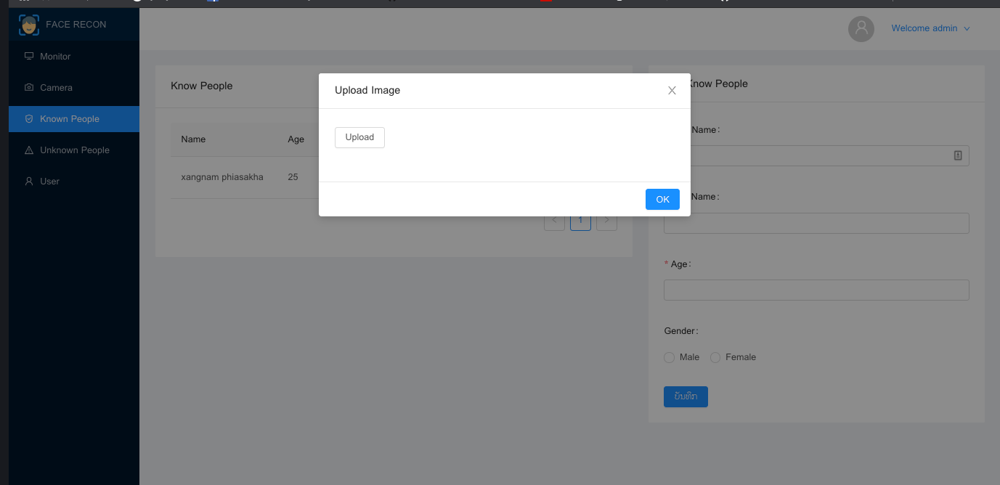
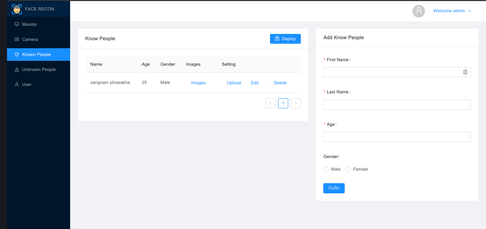
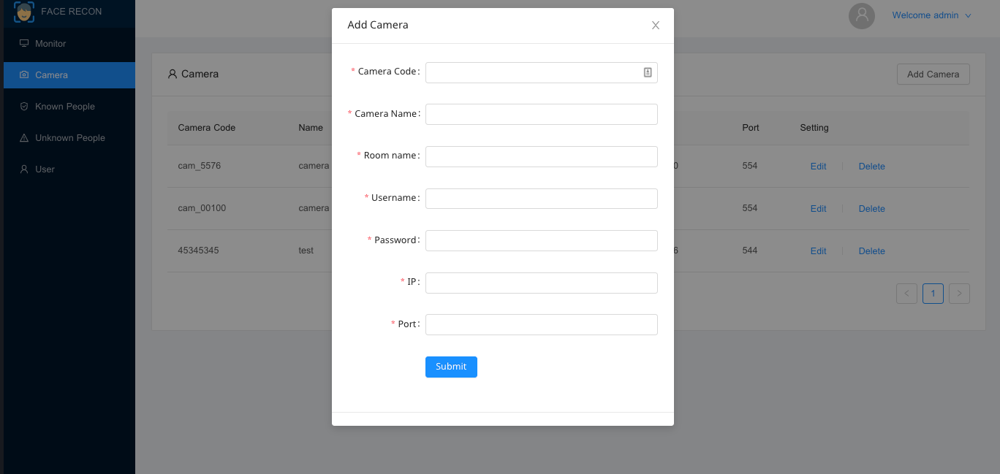

- [English document version](https://github.com/xang555/facerecon_dashboard/blob/master/README.en.md)
- [Lao document version](https://github.com/xang555/facerecon_dashboard/blob/master/README.md)

# FaceRecon Dashboard

Web application for [FaceRecon API](https://github.com/xang555/face_recon)


## Installation

Clone this repo and then run following command:

```bash
npm install 
```

## Running

Start web app by running following command:

```bash
npm start 
```

Then open a web browser and enter following url: [http://localhost:3000](http://localhost:3000)

## Usage

### Setting API URL


By default, Dashboard will call an API from `http://localhost:8080/api/v1`, you can change to your own in App Setting.

### Logging In


You can log in with default authentication which you can change later.

> Username: admin, Password: admin

### Uploading known person image



To make system recognise someone's picture, you have to upload pictures system can detect his/her face and there must be only one person. Converting pictures to embedding vectors and storing in files for face comparison. For now, system still support only 1 person per image which is enough for face verification.

### Deploying



Detect each person's face then convert to embedding vector and save as a file

### Adding Camera



Just fill in the form and you're good to go!

**That's all!! Enjoy**

## TODO

- Drag and drop camera panel
- Add support usb camera
- New style camera pannel
- Run with docker
- Improve this doc
- Write test

## Credit

Implemented from [Vanvixay Thammavong
](https://github.com/skillmonster) Many Thank!

Translated by [Philaphonh Inthavongsa](https://github.com/artydev57)
