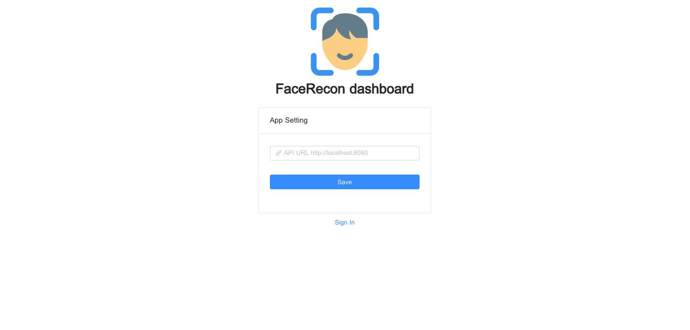
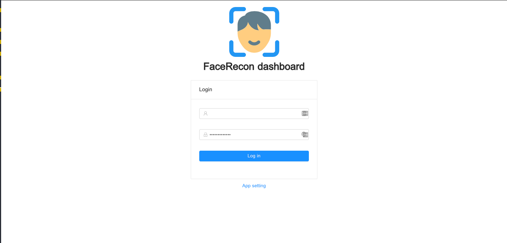

# FaceRecon dashboard

Web Application ສຳລັບໃຊ້ງານ [FaceRecon API](https://github.com/xang555/face_recon)


# Install

clone project ແລະ ເຂົ້າໄປທີ່ root ຂອງ project ໃຊ້ຄຳສັ່ງ

```commandline
$ npm install
```

### Run dashboard

```commandline
$ npm start
```

ຫຼັງຈາກນັ້ນເຂົ້າໄປທີ່ [http://localhost:3000](http://localhost:3000)

### Build dashboard

```commandline
$ npm build
```

# Usage

### Setting API Url



ໂດຍທົ່ວໄປ dashboard ຈະຮ້ອງ faceRecon API ຈາກ url `http://localhost:8080/api/v1` ເຊິ່ງສາມາດປ່ຽນໄດ້ໂດຍໄປທີ່ `App Setting` ແລະ ກຳນົດ API URL ທີ່ຕ້ອງການໄດ້ເລີຍ

### Login



login ດ້ວຍ default authentication ເຊິ່ງສາມາດປ່ຽນໄດ້ທີ່ຫຼັງ

> username ແມ່ນ `admin` ແລະ password ແມ່ນ `admin`

ແລະນັ້ນຄືທັງໝົດ!! `Enjoy`

# TODO

- Drag and drop camera pannel
- add support usb camera
- new style camera pannel
- run with docker
- add english version
- write test

# Credit

dashboard ນີ້ພັດທະນາ ແລະ ປັບປຸງຕໍ່ຈາກ project ຂອງ [Vanvixay Thammavong
](https://github.com/skillmonster) ຂໍ້ຂອບໃຈມາຍັງທີ່ນີ້ດ້ວຍ!
